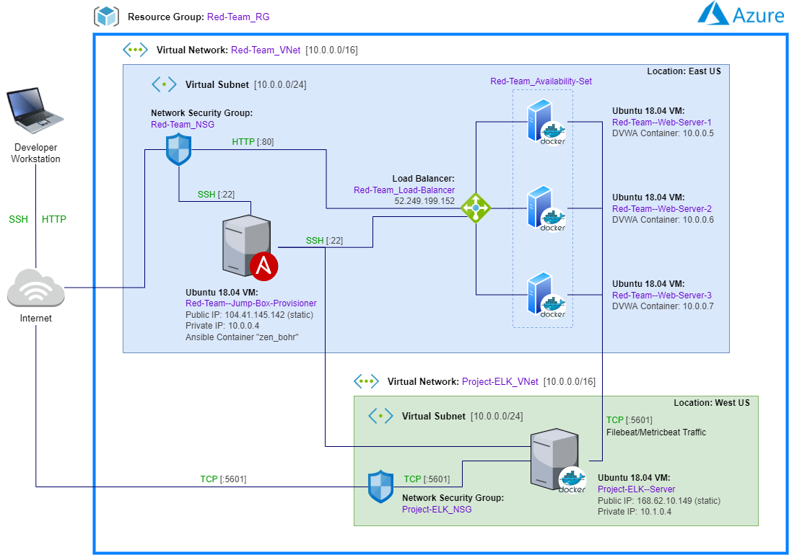
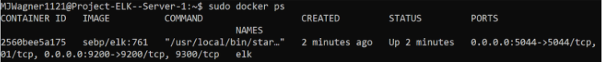
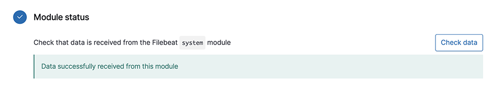

## Automated ELK Stack Deployment

The files in this repository were used to configure the network shown below.



These files were tested and used to build a live ELK stack (Elasticsearch, Logstash, and Kibana) deployment on
the Azure cloud platform. They can be used to recreate the entire deployment pictured above, or select portions of
the [Ansible playbook files](./Ansible/) can be run to install specific features, such as Metricbeat.

This document contains the following details:

- Description of the Topology
- Access Policies
- ELK Configuration
  - Beats in Use
  - Machines Being Monitored
- How to Use the Ansible Build

---

### Description of the Topology

The main purpose of this network is to expose a load-balanced and monitored instance of DVWA, the
D\*mn Vulnerable Web Application.

Load balancing ensures that the application will be both highly available and responsive,
in addition to restricting access to the frontend IP addresses of the virtual network.

Integrating an ELK server allows users to easily monitor vulnerable virtual machines for changes to
the file system and to analyze system metrics.

The configuration details of each machine are found below.

| Name                           | Function   | IP Address | Operating System    |
|:-------------------------------|:-----------|:-----------|:--------------------|
| Red-Team--Jump-Box-Provisioner | Gateway    | 10.0.0.4   | Linux: Ubuntu 18.04 |
| Red-Team--Web-Server-1         | Web Server | 10.0.0.5   | Linux: Ubuntu 18.04 |
| Red-Team--Web-Server-2         | Web Server | 10.0.0.6   | Linux: Ubuntu 18.04 |
| Red-Team--Web-Server-3         | Web Server | 10.0.0.7   | Linux: Ubuntu 18.04 |
| Project-ELK--Server            | ELK Server | 10.1.0.4   | Linux: Ubuntu 18.04 |

---

### Access Policies

The machines on the internal network are not exposed to the public Internet. They are accessible through the
Jump Box, a VM that has been configured to only accept connections from the developer's workstation.

The table below summarizes the access policies in place.

| Name                           | Publicly Accessible | Allowed IP Addresses               |
| :----------------------------- | :------------------ | :--------------------------------- |
| Red-Team--Jump-Box-Provisioner | Yes                 | Developer's workstation            |
| Red-Team--Web-Server-1         | No                  | 10.0.0.4                           |
| Red-Team--Web-Server-2         | No                  | 10.0.0.4                           |
| Red-Team--Web-Server-3         | No                  | 10.0.0.4                           |
| Project-ELK--Server            | No                  | 10.0.0.4 & Developer's workstation |

---

### ELK Configuration

The open source IT engine Ansible was used to automate the configuration of the ELK server.
No configuration was performed manually.
Automating server configuration in this way has many advantages, such as:

- Consistency: Server configurations from simple to complex can be precisely deployed every time
- Efficiency: Easily-run Ansible playbooks reduce the effort required to create multiple environments and set up / update their applications
- Simplicity: Users can get up to speed and be productive quickly, eliminating repetitive tasks that take time and can cause errors

The [ELK server playbook](./Ansible/02-config-elk-server-with-docker.yml) performs the following tasks:

- Installs Docker
- Installs the pip package management system
- Increases the memory size of the VMs
- Downloads and launches the ELK container
- Enables the Docker service to run on boot

The following screenshot displays the result of running `sudo docker ps` after successfully configuring the ELK deployment.



---

### Target Machines & Beats

The ELK server is configured to monitor the following machines:
| Name                   | IP Address |
| :--------------------- | :--------- |
| Red-Team--Web-Server-1 | 10.0.0.5   |
| Red-Team--Web-Server-2 | 10.0.0.6   |
| Red-Team--Web-Server-3 | 10.0.0.7   |

The following Beats (open source data shippers) have been installed on these machines:
- Filebeat
- Metricbeat

These Beats allow us to collect the following information from each machine:
- Filebeat: Monitors log files, collects events, and forwards / centralizes log data
- Metricbeat: Monitors servers by collecting metrics from the operating system and every process running on the system

The data collected by these two Beats is used to build and share dashboards in Kibana that visualize system-level CPU usage,
memory, file system, disk IO, network IO statistics, and more.

---

### Using the Playbooks

In order to use the playbooks you will need to have configured an Ansible control node. Assuming a control node has
been provisioned, SSH into the control node and follow the steps below:

#### Environment Set Up
1. Copy the playbook files that you wish to run from [this GitHub repository](./Ansible/) to your provisioner VM's `/etc/ansible` directory.


2. In your provisioner VM, add the IP addresses of your ELK server and the Web servers you want to monitor to Ansible's hosts file at `/etc/ansible/hosts`:

```
[elkserver]
10.1.0.4 ansible_python_interpreter=/usr/bin/python3

[webservers]
10.0.0.5 ansible_python_interpreter=/usr/bin/python3
10.0.0.6 ansible_python_interpreter=/usr/bin/python3
10.0.0.7 ansible_python_interpreter=/usr/bin/python3
```
  
#### Install the ELK Server
1. Open a Terminal window and run the ELK playbook with the command: `ansible-playbook /etc/ansible/elk-playbook.yml`

2. After the playbook finishes, SSH to your ELK VM. Check that the ELK Docker container is running by entering `sudo docker ps`. Under the second column titled "IMAGE" you should see `sebp/elk`:

```
CONTAINER ID   IMAGE          COMMAND                  CREATED         STATUS         PORTS                                                                    NAMES
2560bee5a175   sebp/elk:761   "/usr/local/bin/star…"   2 minutes ago   Up 2 minutes   0.0.0.0:5044->5044/tcp, 0.0.0.0:5601->5601/tcp, 0.0.0.0:9200->9200/tcp   elk
```
3. Test that you can access the Kibana user interface at `http://[your.VM.IP]:5601/app/kibana`.
<br></br>
#### Install Filebeat
1. In Terminal, run the Filebeat playbook: `ansible-playbook /etc/ansible/filebeat-playbook.yml`

2. From your Kibana home page at `http://[your.VM.IP]:5601/app/kibana`, navigate to Add Logs > System Logs > Deb. Scroll down to the "Module status" section and click the "Check Data" button. If successful, you should see a "Data successfully received from this module" message:



#### Install Metricbeat
1. Run the Metricbeat playbook: `ansible-playbook /etc/ansible/metricbeat-playbook.yml`

2. From your Kibana home page, navigate to Add Metric Data > Docker Metrics > Deb. Scroll down to the "Module status" section and click the "Check Data" button. If successful, you should see a "Data successfully received from this module" message like the Filebeat screenshot above.
